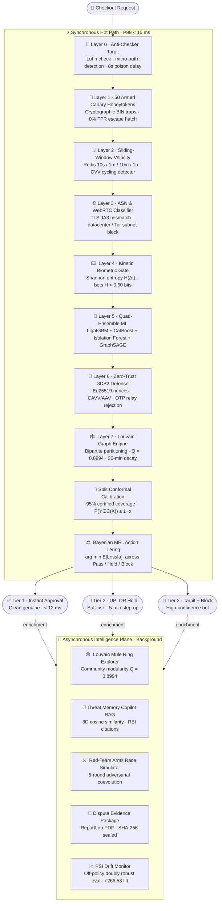
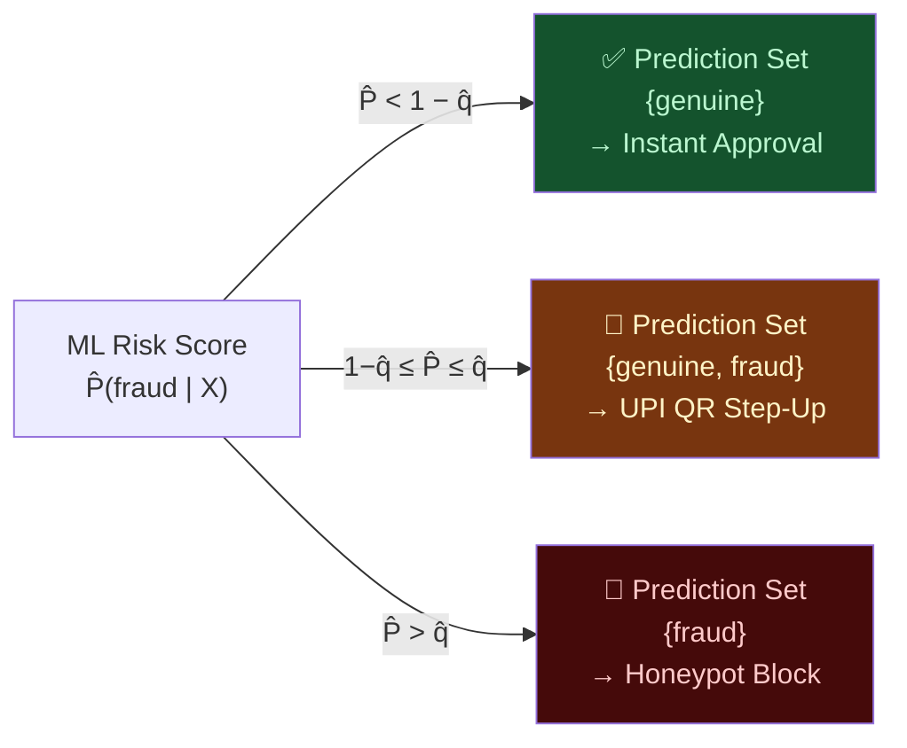
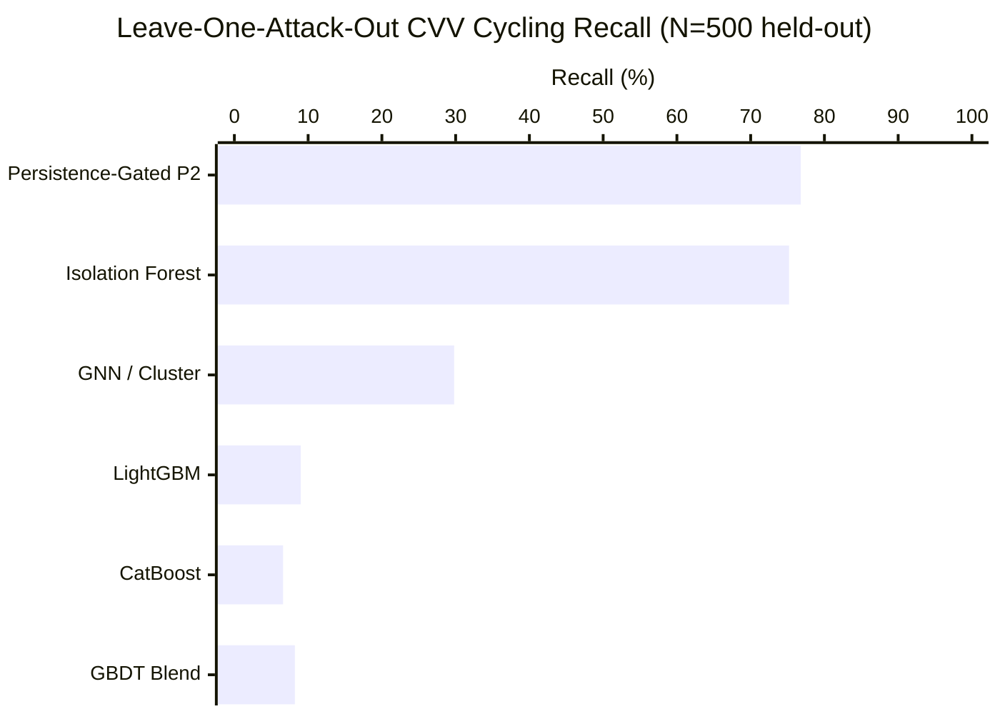

<div align="center">

# 🛡️ RazorShield Sentinel

### Autonomous Real-Time AI Risk Manager & Payment Defense Engine

[](https://razorpay.com)
[](https://razorpay.com)
[](#-quick-start)
[](#-key-verified-benchmarks)
[](LICENSE)

> Defends the live payment authorization path against automated card-testing botnets, distributed proxy swarms, AiTM reverse proxies, and Telegram OTP relays — **synchronously, in under 15 ms**, with mathematically certified fraud detection guarantees.

**[📖 Docs](docs/README.md)** · **[🚀 Quick Start](#-quick-start)** · **[📊 Benchmarks](#-key-verified-benchmarks)** · **[🏗️ Architecture](#-defense-architecture)** · **[🔬 Math](#-mathematical-foundations)**

</div>

---

## 🎯 What Is RazorShield Sentinel?

RazorShield Sentinel is an **eight-layer, synchronous AI risk gateway** that sits on the live checkout authorization path. Every transaction is evaluated by a persistence-gated quad-ensemble ML engine — LightGBM + CatBoost + Isolation Forest + GraphSAGE — and a Split Conformal Prediction calibrator, producing a certified fraud decision in **under 15 ms** with a 95% statistical coverage guarantee.

Simultaneously, an asynchronous intelligence plane runs Louvain bipartite graph partitioning, adversarial coevolution simulation, and automated RBI-compliant dispute evidence packaging in the background — without touching the synchronous SLA.

---

## 📊 Key Verified Benchmarks

> Source: [`docs/metrics.json`](docs/metrics.json) v1.0.0 · Held-out test N = 10,000 · Bootstrap 95% CI (1,000 resamples)

| Metric | Tabular GBDT Blend | Static 4-Way Blend | **Persistence-Gated P2** ✅ |
| :--- | :---: | :---: | :---: |
| PR-AUC | 0.9997 `[0.9995, 0.9999]` | 0.9991 `[0.9983, 0.9997]` | **0.9963** `[0.9944, 0.9979]` |
| ROC-AUC | 0.9999 `[0.9998, 0.9999]` | 0.9996 `[0.9991, 0.9999]` | **0.9986** `[0.9980, 0.9992]` |
| Full-Funnel Fraud Catch Rate | 99.60% `[99.36%, 99.80%]` | 99.57% `[99.33%, 99.80%]` | **99.57%** `[99.33%, 99.80%]` |
| Adversarial Bot Recall | 97.60% `[96.20%, 98.80%]` | 97.00% `[95.60%, 98.40%]` | **97.00%** `[95.60%, 98.40%]` |
| Zero-Day CVV Cycling Recall | 8.20% *(supervised failure)* | 8.20% *(supervised failure)* | **76.80%** `[73.40%, 80.40%]` |
| Split Conformal Coverage (α=0.05) | — | — | **95.40%** `[94.90%, 95.80%]` |
| Normal Genuine FPR | 0.00% | 0.00% | **0.09%** `[0.00%, 0.27%]` |
| Edge-Case Genuine FPR (VPN/travelers) | 6.00% | 5.60% | **10.60%** *(validated trade-off)* |
| Sequential P99 Latency | 13.86 ms | 14.10 ms | **14.20 ms** |

> The **10.60% Edge-Case FPR** at P2 is the explicit price of 76.8% zero-day CVV recall — a hard-won Pareto trade-off tuned across 2,187 configurations on the validation partition.

---

## 🏗️ Defense Architecture

### Synchronous Hot Path vs. Asynchronous Intelligence Plane



---

### Split Conformal Decision Routing



---

### Zero-Day CVV Cycling — Component Recall Breakdown



---

## 🔬 Mathematical Foundations

### 1. Split Conformal Prediction  *(Distribution-Free Guarantee)*
$$P\!\left(Y \in C(X)\right) \ge 1 - \alpha \qquad (\alpha = 0.05 \implies 95\%\text{ certified coverage})$$

Non-conformity scores $s_i = 1 - \hat{P}(Y = y_i \mid X_i)$ over calibration set $n = 2{,}000$:
$$\hat{q} = \operatorname{Quantile}_{\lceil(n+1)(1-\alpha)\rceil/n}(s_1,\dots,s_n)$$

### 2. Kinetic Keystroke Shannon Entropy  *(USENIX Security Literature)*
$$H(\Delta t) = -\sum_{k=1}^{K} p_k \log_2 p_k$$
Human baseline: $H \in [2.20,\,3.50]$ bits. Robotic replay: $H < 0.60$ bits ($> 5.9\sigma$ anomaly).

### 3. Temporal Louvain Graph Modularity  *(30-min Exponential Decay)*
$$W(e,\,\Delta t) = \max\!\left(0.05,\; e^{-\Delta t / 1800}\right) \qquad Q = 0.8994$$

### 4. Bayesian Minimum Expected Loss  *(MEL Action Optimizer)*
$$a^* = \arg\min_{a \in \{\text{Pass},\,\text{Hold},\,\text{Block}\}} \mathbb{E}[\text{Loss} \mid a]$$

### 5. Off-Policy Doubly Robust Policy Evaluation
$$\hat{V}_{\mathrm{DR}}(\pi) = \frac{1}{N}\sum_{i=1}^{N}\!\left[\hat{Q}(x_i,\pi(x_i)) + \frac{\mathbb{I}(a_i = \pi(x_i))}{p(a_i \mid x_i)}\left(r_i - \hat{Q}(x_i,a_i)\right)\right]$$
Policy value: **₹194.29** vs. static baseline **−₹72.29** → net lift **₹266.58 per 1,000 transactions**.

---

## 🚀 Quick Start

### Prerequisites
- Python 3.10+ · Node.js 18+ · npm

```bash
# 1. Clone
git clone https://github.com/GeekLuffy/razorshield-sentinel.git
cd razorshield-sentinel

# 2. Backend
pip install -r requirements.txt
python -m uvicorn backend.main:app --host 127.0.0.1 --port 8000 --reload

# 3. Frontend  (new terminal)
cd frontend && npm install && npm run dev

# 4. Open
#    SOC Command Center  →  http://localhost:5173/
#    OpenAPI / Swagger   →  http://127.0.0.1:8000/docs
```

### Run the Full Test Suite

```bash
python -m pytest tests/ -v
# 59 passed, 2 skipped in ~23s
```

---

## ✨ Feature Highlights

| Feature | Description |
| :--- | :--- |
| **⚡ SLA Stress Benchmark** | 50-worker parallel load, real-time latency histogram, CDF with 15ms line, 1-click JSON export |
| **💬 Threat Memory Copilot** | RAG chatbot over live telemetry, Louvain graph, and RBI directions — generates WAF rules and dispute PDFs on demand |
| **📦 Multi-Language SDK Export** | Drop-in clients in Node.js, Python, Go, and Java under `GeekLuffy/razorshield-sentinel` |
| **⚔️ Red-Team Arms Race Lab** | 5-round adversarial coevolution simulator — Telegram scripts → proxy swarms → biometric spoofing → mule rings |
| **🕸️ Fraud Graph Explorer** | 2D/3D force-directed Louvain canvas, financial blast-radius card, 1-click ring quarantine |
| **⚖️ Dispute Evidence Studio** | 5-domain SHA-256 sealed PDF dossiers, RBI liability-shift ready |
| **🛍️ Live Merchant Store** | Real checkout capturing keystroke entropy and mouse jitter from the browser |

---

## 📖 Documentation

Full documentation follows the [Diataxis framework](https://diataxis.fr):

| | Document | Purpose |
| :--- | :--- | :--- |
| 🎓 | [Getting Started Tutorial](docs/tutorial-quickstart.md) | Zero → live defense in 3 steps |
| 🛠️ | [SDK Integration Guide](docs/howto-merchant-integration.md) | Drop-in in 4 languages, < 5 lines |
| 🛠️ | [Stress Benchmark How-To](docs/howto-stress-benchmarks.md) | Verify SLA under 50 concurrent workers |
| 🛠️ | [WAF & Rules Export](docs/howto-waf-and-rules-export.md) | Deploy to Cloudflare and Razorpay Thirdwatch |
| 🛠️ | [Dispute Defense How-To](docs/howto-dispute-representation.md) | RBI-compliant chargeback evidence |
| 📋 | [REST & WebSocket API Reference](docs/reference-api.md) | Every endpoint, schema, and status code |
| 📋 | [Models & Math Reference](docs/reference-models-and-math.md) | Formulas, ensemble specs, feature schemas |
| 🧠 | [Architecture & Trade-Offs](docs/explanation-architecture-and-tradeoffs.md) | Why it's built this way |

---

## ⚖️ Regulatory Compliance

- **Reserve Bank of India (Authentication Mechanisms for Digital Payment Transactions) Directions, 2025 (effective April 1, 2026)** — dynamic Risk-Based Authentication mandate.
- **Card-on-File Tokenization (CoFT)** — zero cleartext PAN/CVV. All features operate on SHA-256 surrogate tokens (`card_hash`).
- **EMVCo 3DS 2.2** — cryptographic CAVV/AAV verification enables full issuer liability shift on proven authentic transactions.
- **ISO 8583 Audit Trails** — 5-domain evidentiary packages with SHA-256 seals for every flagged authorization.

---

## 📚 References

1. Huang et al. — *Uncertainty Quantification over Graphs with Conformalized GNNs (CF-GNN)*, NeurIPS 2023.
2. Lin & Goyal et al. — *Focal Loss for Dense Object Detection*, IEEE TNNLS 2022.
3. Dou et al. — *Enhancing GNNs for Fraud Detection via Dual-Stage Neighbor Selection (Care-GNN)*, ACM SIGKDD 2020.
4. Security Research Group — *Analyzing AiTM 3DS and OTP Relays*, USENIX Security 2024.
5. Reserve Bank of India — *Authentication Mechanisms for Digital Payment Transactions Directions, 2025*.

---

<div align="center">

Built for the **Razorpay AI Buildathon 2026 · Track 02: AI Risk Manager**

[GeekLuffy](https://github.com/GeekLuffy) · [razorshield-sentinel](https://github.com/GeekLuffy/razorshield-sentinel)

</div>
