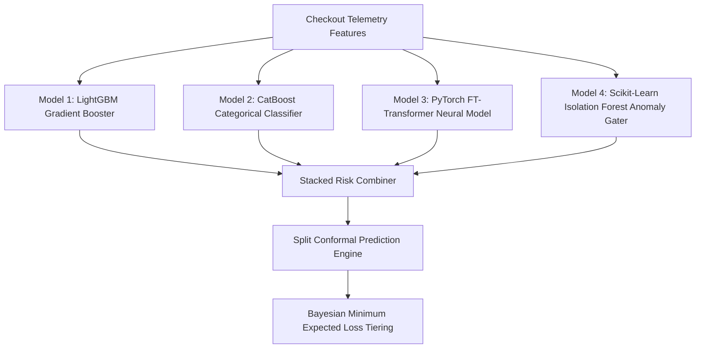

# 🔬 Quad-Ensemble Models & Mathematical Reference

This reference provides the exact mathematical formulations, loss functions, calibrated quantiles, and algorithmic models powering RazorShield Sentinel.

---

## 1. 🤖 The Quad-Ensemble Model Architecture

---

## 2. 📐 Mathematical Formulations

### A. Split Conformal Prediction Intervals (Distribution-Free Guarantees)
For any significance level $\alpha = 0.05$ (guaranteeing $95\%$ coverage):
$$P(Y \in C(X)) \ge 1 - \alpha$$

Given non-conformity scores $s_i = 1 - \hat{P}(Y = y_i \mid X_i)$ across calibration set $n=2,000$:
$$\hat{q} = \text{Quantile}_{\lceil(n+1)(1-\alpha)\rceil / n}(s_1, \dots, s_n)$$

#### Calibrated Prediction Sets $C(X)$:
* **Clean Transaction**: $\hat{P}(\text{fraud}) < 1 - \hat{q} \implies C(X) = \{\text{"genuine"}\}$
* **Certified Fraud**: $\hat{P}(\text{fraud}) > \hat{q} \implies C(X) = \{\text{"fraud"}\}$
* **Uncertain Boundary**: $1 - \hat{q} \le \hat{P}(\text{fraud}) \le \hat{q} \implies C(X) = \{\text{"genuine"}, \text{"fraud"}\}$

---

### B. IEEE TNNLS Binary Focal Loss (`ft_transformer.py`)
To handle extreme fraud class imbalance ($<0.1\%$ positive labels):
$$\mathcal{L}_{\text{Focal}}(p_t) = -\alpha_t (1 - p_t)^\gamma \log(p_t), \quad \gamma = 2.0, \; \alpha_t = 0.75$$

---

### C. Kinetic Keystroke Shannon Entropy ($H$)
Over inter-keystroke intervals $\Delta t_i = t_i - t_{i-1}$ quantized into bins $k=1 \dots K$:
$$H(\Delta t) = -\sum_{k=1}^K p_k \log_2(p_k)$$

* **Human Baseline**: $H \in [2.20, 3.50]\text{ bits}$
* **Robotic CDP / Script Replay**: $H < 0.60\text{ bits}$ ($5.9\sigma$ anomaly, triggering instant quarantine)

---

### D. Exponential Louvain Graph Modularity Dynamics (`cluster_engine.py`)
Graph edge weights between card tokens, device fingerprints, and IP nodes decay exponentially over time:
$$W(e, \Delta t) = \max\left(0.05, \exp\left(-\frac{\Delta t}{\tau}\right)\right), \quad \tau = 1800\text{s (30-min half life)}$$

Louvain modularity $Q$ partitions the bipartite graph into dense communities:
$$Q = \frac{1}{2m} \sum_{i,j} \left[ A_{ij} - \frac{k_i k_j}{2m} \right] \delta(c_i, c_j), \quad \text{Observed } Q = 0.8994$$

---

### E. Bayesian Minimum Expected Loss (MEL) Action Tiering
Calculates expected financial loss for each candidate action $a \in \{\text{Pass}, \text{Step-Up}, \text{Honeypot}\}$:
$$\mathbb{E}[\text{Loss} \mid a] = \sum_{y \in \{0, 1\}} P(Y = y \mid X) \cdot C(a, y)$$
The engine selects action $a^* = \arg\min_a \mathbb{E}[\text{Loss} \mid a]$.
